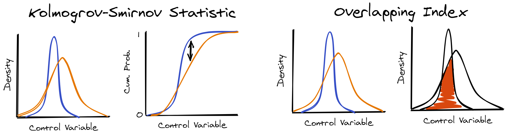

When you match distribution-wise, you're controlling for confounding variables by making sure that they are similarly distributed in all experimental conditions. To do this, you can use any assumption-free measure of distributional similarity/distance. The two measures I like to use to do this are: the [Kolmogrov-Smirnov Statistic](https://en.wikipedia.org/wiki/Kolmogorov%E2%80%93Smirnov_test), and the Overlapping Index ([Pastore & Calgni, 2019](http://doi.org/10.3389/fpsyg.2019.01089)). When you're matching by the overlapping index you want to maximise, but when you're matching by the Kolmogrov-Smirnov (K-S) statistic, you want to minimise. Apart from this, the two measures will produce similar results.

<br>



<br>

Here you can find some solutions to example problems. All the example code here uses the same dataset: [stim_pool.csv](dat/stim_pool.csv). The first two examples are simple cases, where you want to match two conditions on one numeric variable. The other examples show how you can adapt this to more complicated designs.

<br>

```{r, echo=FALSE, message=FALSE}
library(tibble)
library(dplyr)
library(kableExtra)

# function which translates y/n values into latex symbols for tick and cross
tickcross <- function(x, tick="y", cross="n") ifelse(x==tick, "$\\checkmark$", ifelse(x==cross, "$\\mathbf{\\times}$", "?"))

tribble(
  ~`Title/Link`, ~`Measure`, ~`No. Conditions`, ~`No. Control Variables`, ~`Variable Weighting`,
  "[01 - Maximising Distributional Overlap](dw_01_max_distributional_overlap.html)", "Overlap", 2, 1, "n",
  "[02 - Minimising Kolmogrov-Smirnov](dw_02_min_kolmogrov-smirnov.html)", "K-S Statistic", 2, 1, "n",
  "[03 - Multiple Control Variables](dw_03_multiple_controls.html)", "Overlap", 2, 3, "n",
  "[04 - Matching >2 Conditions](dw_04_more_than_2_conds.html)", "Overlap", 3, 3, "n",
  "[05 - How Many Iterations to Run?](dw_05_deciding_n.html)", "Overlap", 3, 3, "n"
) %>%
  mutate(
    `Variable Weighting` = tickcross(`Variable Weighting`)
  ) %>%
  knitr::kable(align = c("l", "l", "c", "c", "c", "c", "c", "c")) %>%
  kable_styling() %>%
  column_spec(1, width="35%") %>%
  column_spec(2, width="10%")
```
