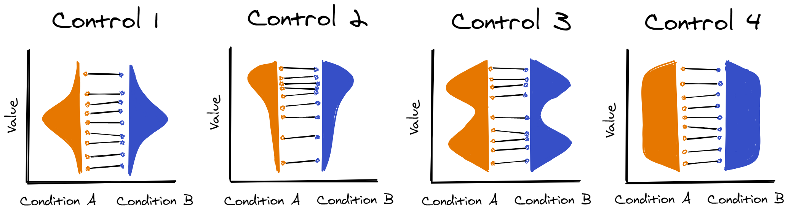

```{r, incude=FALSE, echo=FALSE, message=FALSE}
library(fontawesome)
```

When you match item-wise, you're finding items in each condition which are directly comparable across control variables. I mostly use the R package [LexOPS](https://github.com/jackedtaylor/lexops#readme) to do this because it makes the code more readable, but code could be written to do the same thing in any other language. You could also get similar results using a different algorithm.

<br>



<br>

Here you can find some solutions to example problems. All the example code here uses the same dataset: [stim_pool.csv](dat/stim_pool.csv). Most of the examples use LexOPS for simplicity, but the last example shows example code without LexOPS to better explain what's going on.

To use LexOPS in R, you will need to install it. You can do this with:

```{r, eval=FALSE}
devtools::install_github("jackedtaylor/lexops@*release")
```

<br>

```{r, echo=FALSE, message=FALSE}
library(tibble)
library(dplyr)
library(kableExtra)

# function which translates y/n values into latex symbols for tick and cross
tickcross <- function(x, tick="y", cross="n") ifelse(x==tick, "$\\checkmark$", ifelse(x==cross, "$\\mathbf{\\times}$", "?"))

tribble(
  ~`Title/Link`, ~`No. Conditions`, ~`No. Control Variables`, ~`Numeric Controls`, ~`Categorical Controls`, ~`Inclusive Matching`, ~`Euclidean Distance`,
  "[01 - Item-Wise Matching](iw_01_item-wise.html)", 2, 1, "y", "n", "n", "n",
  "[02 - Multiple Control Variables](iw_02_multiple_controls.html)", 2, 4, "y", "y", "n", "n",
  "[03 - Matching >2 Conditions](iw_03_more_than_2_conds.html)", 3, 4, "y", "y", "n", "n",
  "[04 - Setting the Match Null](iw_04_match_nulls.html)", 3, 4, "y", "y", "y", "n",
  "[05 - Matching Factorial Designs](iw_05_factorial_designs.html)", 6, 3, "y", "n", "y", "n",
  "[06 - Matching in Euclidean Distance](iw_06_euclidean_dist.html)", 3, 4, "y", "y", "y", "y",
  "[07 - Weighting Euclidean Distance](iw_07_weighting_euc_dist.html)", 3, 4, "y", "y", "y", "y",
  "[08 - Item-Wise Matching from Scratch](iw_08_from_scratch.html)", 2, 1, "y", "n", "n", "n"
) %>%
  mutate(
    `Numeric Controls` = tickcross(`Numeric Controls`),
    `Categorical Controls` = tickcross(`Categorical Controls`),
    `Inclusive Matching` = tickcross(`Inclusive Matching`),
    `Euclidean Distance` = tickcross(`Euclidean Distance`)
  ) %>%
  knitr::kable(align = c("l", "c", "c", "c", "c", "c", "c")) %>%
  kable_styling() %>%
  column_spec(1, width="35%")
```

```{r, echo=FALSE, message=FALSE}
# create a zip folder of all the RMarkdown examples
zip("itemwise.zip", list.files(pattern = "^iw_\\d{2}_.+\\.Rmd$"))
```

[`r fa(name = "download")` Download code for all examples](itemwise.zip)

These examples show how you can use LexOPS to apply the methods covered in the workshop. To find out more about the things you can do with LexOPS, you might also be interested in the [LexOPS Walkthrough](https://jackedtaylor.github.io/LexOPSdocs).
